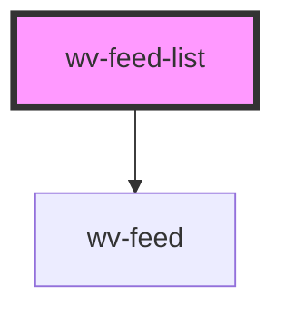

# wv-feed-list

<!-- Auto Generated Below -->

## Properties

| Property  | Attribute  | Description | Type     | Default   |
| --------- | ---------- | ----------- | -------- | --------- |
| `isDebug` | `is-debug` |             | `string` | `"false"` |
| `records` | `records`  |             | `string` | `"{}"`    |

## Dependencies

### Depends on

- [wv-feed](..\wv-feed)

### Graph

----------------------------------------------

*Built with [StencilJS](https://stenciljs.com/)*
