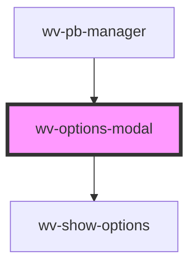

# wv-options-modal

<!-- Auto Generated Below -->

## Dependencies

### Used by

 - [wv-pb-manager](..\wv-pb-manager)

### Depends on

- [wv-show-options](..\wv-show-options)

### Graph

----------------------------------------------

*Built with [StencilJS](https://stenciljs.com/)*
