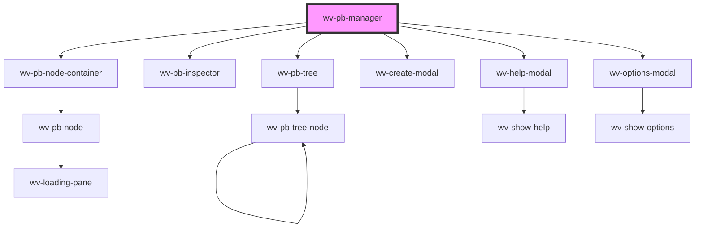

# wv-pb-manager

<!-- Auto Generated Below -->

## Properties

| Property      | Attribute       | Description | Type     | Default     |
| ------------- | --------------- | ----------- | -------- | ----------- |
| `pageId`      | `page-id`       |             | `string` | `undefined` |
| `recordId`    | `record-id`     |             | `string` | `undefined` |
| `siteRootUrl` | `site-root-url` |             | `string` | `undefined` |

## Dependencies

### Depends on

- [wv-pb-node-container](..\wv-pb-node-container)
- [wv-pb-inspector](..\wv-pb-inspector)
- [wv-pb-tree](..\wv-pb-tree)
- [wv-create-modal](..\wv-create-modal)
- [wv-help-modal](..\wv-help-modal)
- [wv-options-modal](..\wv-options-modal)

### Graph

----------------------------------------------

*Built with [StencilJS](https://stenciljs.com/)*
