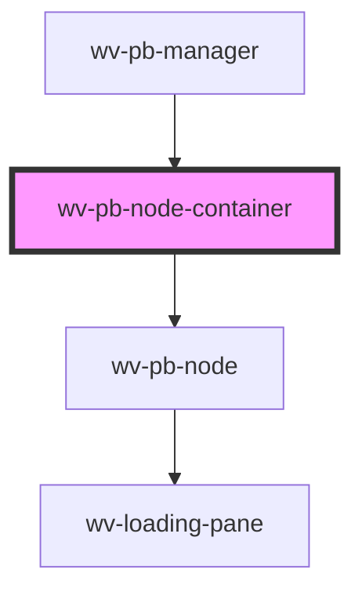

# wv-pb-node-container

<!-- Auto Generated Below -->

## Properties

| Property       | Attribute        | Description | Type     | Default |
| -------------- | ---------------- | ----------- | -------- | ------- |
| `containerId`  | `container-id`   |             | `string` | `null`  |
| `parentNodeId` | `parent-node-id` |             | `string` | `null`  |

## Dependencies

### Used by

 - [wv-pb-manager](..\wv-pb-manager)

### Depends on

- [wv-pb-node](..\wv-pb-node)

### Graph

----------------------------------------------

*Built with [StencilJS](https://stenciljs.com/)*
