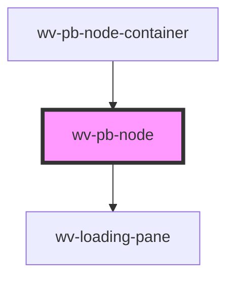

# wv-pb-node

<!-- Auto Generated Below -->

## Properties

| Property | Attribute | Description | Type     | Default     |
| -------- | --------- | ----------- | -------- | ----------- |
| `nodeId` | `node-id` |             | `string` | `undefined` |

## Dependencies

### Used by

 - [wv-pb-node-container](..\wv-pb-node-container)

### Depends on

- [wv-loading-pane](..\wv-loading-pane)

### Graph

----------------------------------------------

*Built with [StencilJS](https://stenciljs.com/)*
