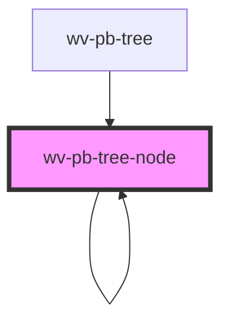

# wv-pb-tree-node

<!-- Auto Generated Below -->

## Properties

| Property | Attribute | Description | Type     | Default     |
| -------- | --------- | ----------- | -------- | ----------- |
| `level`  | `level`   |             | `number` | `0`         |
| `node`   | --        |             | `Object` | `undefined` |

## Dependencies

### Used by

 - [wv-pb-tree](..\wv-pb-tree)
 - [wv-pb-tree-node]()

### Depends on

- [wv-pb-tree-node]()

### Graph

----------------------------------------------

*Built with [StencilJS](https://stenciljs.com/)*
