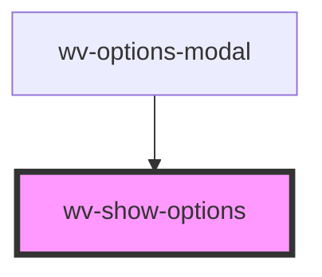

# wv-show-options

<!-- Auto Generated Below -->

## Properties

| Property | Attribute | Description | Type     | Default |
| -------- | --------- | ----------- | -------- | ------- |
| `nodeId` | `node-id` |             | `string` | `""`    |

## Dependencies

### Used by

 - [wv-options-modal](..\wv-options-modal)

### Graph

----------------------------------------------

*Built with [StencilJS](https://stenciljs.com/)*
