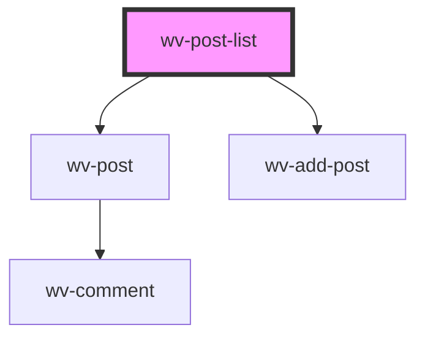

# wv-post-list

<!-- Auto Generated Below -->

## Properties

| Property          | Attribute           | Description | Type     | Default   |
| ----------------- | ------------------- | ----------- | -------- | --------- |
| `currentUser`     | `current-user`      |             | `string` | `"{}"`    |
| `isDebug`         | `is-debug`          |             | `string` | `"false"` |
| `posts`           | `posts`             |             | `string` | `"[]"`    |
| `relatedRecordId` | `related-record-id` |             | `string` | `null`    |
| `relatedRecords`  | `related-records`   |             | `string` | `null`    |
| `siteRootUrl`     | `site-root-url`     |             | `string` | `null`    |

## Dependencies

### Depends on

- [wv-post](../wv-post)
- [wv-add-post](../wv-add-post)

### Graph

----------------------------------------------

*Built with [StencilJS](https://stenciljs.com/)*
