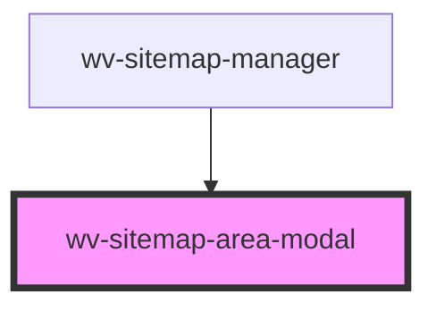

# wv-sitemap-area-modal

<!-- Auto Generated Below -->

## Properties

| Property         | Attribute | Description | Type     | Default                  |
| ---------------- | --------- | ----------- | -------- | ------------------------ |
| `area`           | --        |             | `Object` | `null`                   |
| `submitResponse` | --        |             | `Object` | `{message:"",errors:[]}` |

## Events

| Event                                 | Description | Type               |
| ------------------------------------- | ----------- | ------------------ |
| `wvSitemapManagerAreaModalCloseEvent` |             | `CustomEvent<any>` |
| `wvSitemapManagerAreaSubmittedEvent`  |             | `CustomEvent<any>` |

## Dependencies

### Used by

 - [wv-sitemap-manager](../wv-sitemap-manager)

### Graph

----------------------------------------------

*Built with [StencilJS](https://stenciljs.com/)*
