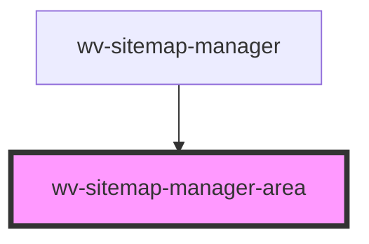

# wv-sitemap-manager-area

<!-- Auto Generated Below -->

## Properties

| Property | Attribute | Description | Type     | Default     |
| -------- | --------- | ----------- | -------- | ----------- |
| `area`   | --        |             | `Object` | `undefined` |

## Events

| Event                             | Description | Type               |
| --------------------------------- | ----------- | ------------------ |
| `wvSitemapManagerAreaDeleteEvent` |             | `CustomEvent<any>` |
| `wvSitemapManagerAreaManageEvent` |             | `CustomEvent<any>` |
| `wvSitemapManagerNodeDeleteEvent` |             | `CustomEvent<any>` |
| `wvSitemapManagerNodeManageEvent` |             | `CustomEvent<any>` |

## Dependencies

### Used by

 - [wv-sitemap-manager](..\wv-sitemap-manager)

### Graph

----------------------------------------------

*Built with [StencilJS](https://stenciljs.com/)*
