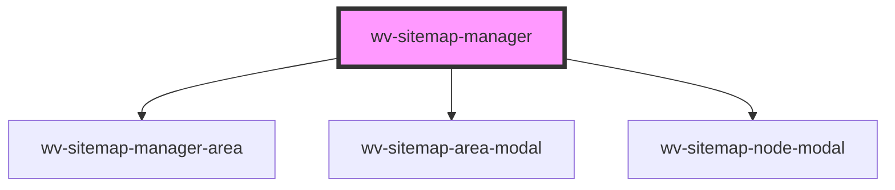

# wv-sitemap-manager

<!-- Auto Generated Below -->

## Properties

| Property   | Attribute   | Description | Type     | Default     |
| ---------- | ----------- | ----------- | -------- | ----------- |
| `apiRoot`  | `api-root`  |             | `string` | `undefined` |
| `appId`    | `app-id`    |             | `string` | `undefined` |
| `initData` | `init-data` |             | `string` | `undefined` |

## Dependencies

### Depends on

- [wv-sitemap-manager-area](../wv-sitemap-manager-area)
- [wv-sitemap-area-modal](../wv-sitemap-area-modal)
- [wv-sitemap-node-modal](../wv-sitemap-node-modal)

### Graph

----------------------------------------------

*Built with [StencilJS](https://stenciljs.com/)*
