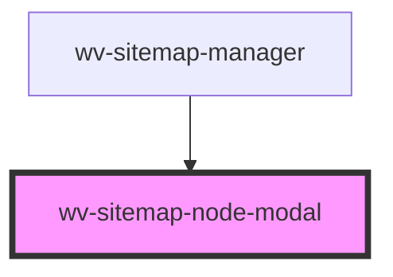

# wv-sitemap-node-modal

<!-- Auto Generated Below -->

## Properties

| Property         | Attribute  | Description | Type     | Default                                 |
| ---------------- | ---------- | ----------- | -------- | --------------------------------------- |
| `apiRoot`        | `api-root` |             | `string` | `undefined`                             |
| `appId`          | `app-id`   |             | `string` | `undefined`                             |
| `nodeAuxData`    | --         |             | `Object` | `undefined`                             |
| `nodeObj`        | --         |             | `Object` | `{areaId:null,node:null,area:null}`     |
| `nodePageDict`   | --         |             | `Object` | `null`                                  |
| `submitResponse` | --         |             | `Object` | `{message: "",errors: [],success:true}` |

## Events

| Event                                    | Description | Type               |
| ---------------------------------------- | ----------- | ------------------ |
| `wvSitemapManagerNodeAuxDataUpdateEvent` |             | `CustomEvent<any>` |
| `wvSitemapManagerNodeModalCloseEvent`    |             | `CustomEvent<any>` |
| `wvSitemapManagerNodeSubmittedEvent`     |             | `CustomEvent<any>` |

## Dependencies

### Used by

 - [wv-sitemap-manager](../wv-sitemap-manager)

### Graph

----------------------------------------------

*Built with [StencilJS](https://stenciljs.com/)*
