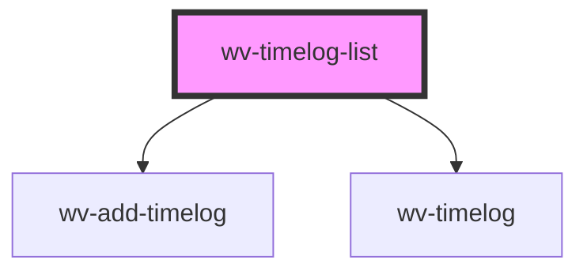

# wv-post-list

<!-- Auto Generated Below -->

## Properties

| Property         | Attribute         | Description | Type      | Default   |
| ---------------- | ----------------- | ----------- | --------- | --------- |
| `currentUser`    | `current-user`    |             | `string`  | `"{}"`    |
| `isBillable`     | `is-billable`     |             | `boolean` | `true`    |
| `isDebug`        | `is-debug`        |             | `string`  | `"false"` |
| `records`        | `records`         |             | `string`  | `"[]"`    |
| `relatedRecords` | `related-records` |             | `string`  | `null`    |
| `siteRootUrl`    | `site-root-url`   |             | `string`  | `null`    |

## Dependencies

### Depends on

- [wv-add-timelog](..\wv-add-timelog)
- [wv-timelog](..\wv-timelog)

### Graph

----------------------------------------------

*Built with [StencilJS](https://stenciljs.com/)*
