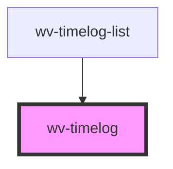

# wv-post

<!-- Auto Generated Below -->

## Properties

| Property | Attribute | Description | Type     | Default        |
| -------- | --------- | ----------- | -------- | -------------- |
| `post`   | --        |             | `Object` | `new Object()` |

## Dependencies

### Used by

 - [wv-timelog-list](..\wv-timelog-list)

### Graph

----------------------------------------------

*Built with [StencilJS](https://stenciljs.com/)*
